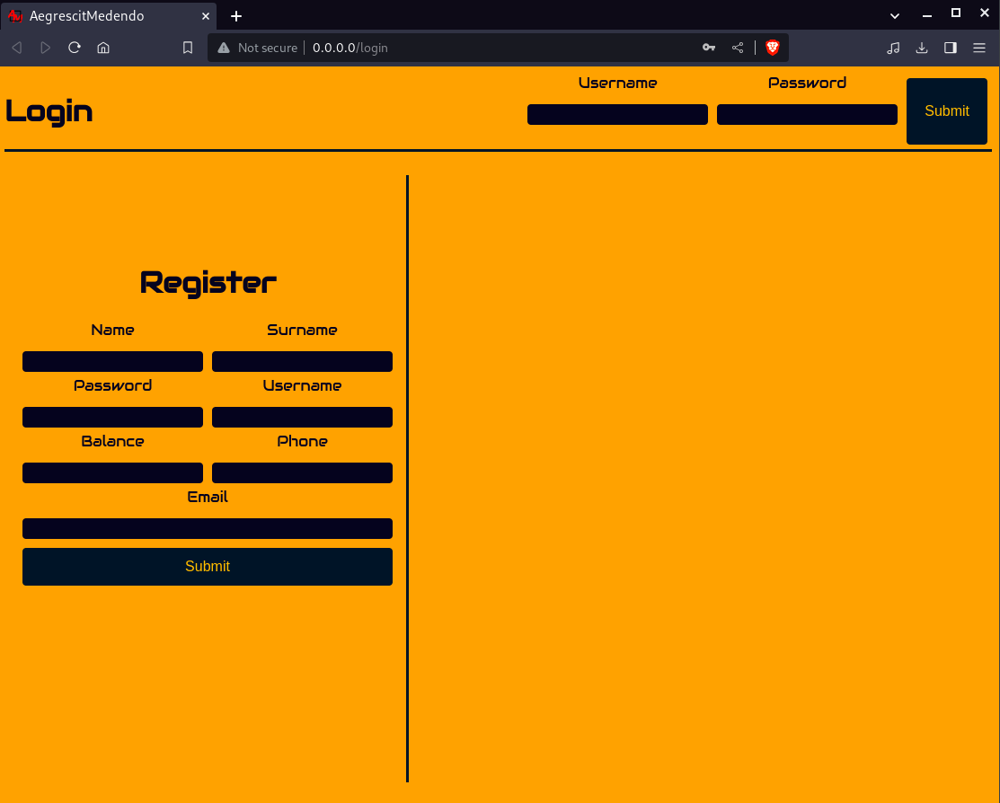
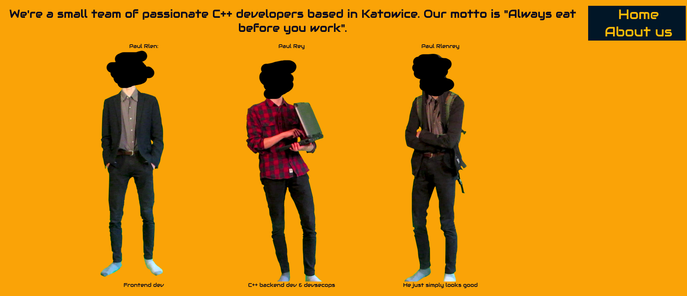
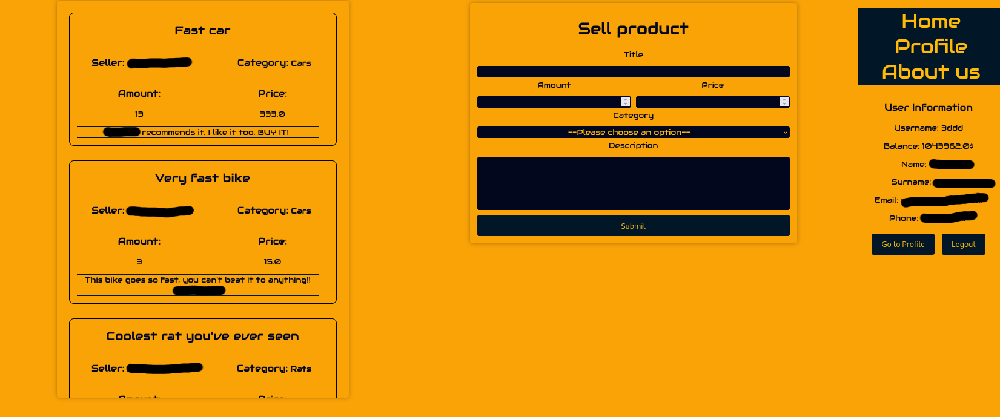

# AegrescitMedendo

Project overview and idea behind it.

I made this proof of concept project to kinda show off to my programming proffesor. I was under the impression that, he didn't think I could write a working web application based on c++. In order to show him that with modern tools it can be done, I've made this little app.

It uses crow for most web-related stuff, sqlite_orm for database management and other small libraries if needed

More about the initial idea in [here](./docs/InitialIdea.pdf)

## Screenshots







# Running

## Bootstraping

```sh
# odb
sudo apt install odb

# crow
cd AegrescitMedendo
cd external 
git clone https://github.com/fnc12/sqlite_orm.git

sudo dpkg -i "$TEMP_DEB"
rm -f "$TEMP_DEB"
```

Also, read README inside AegrescitMedendo directory.

# Running

```sh
cd AegrescitMedendo/
sudo ./build.sh
```

Your website should be reachable at http://0.0.0.0:80/
