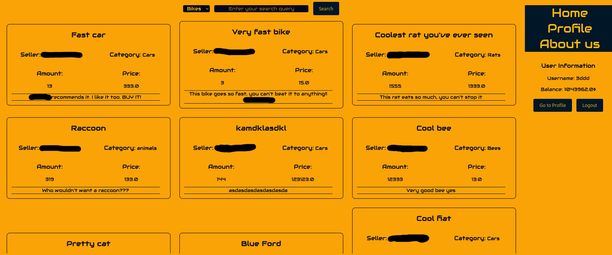

# AegrescitMedendo

I made this proof of concept project in my second semester of college to kinda show off to my programming proffesor. I was under the impression, that he didn't think I could write a working web application based on c++. In order to show him that with modern tools it can be done, I've made this little app.

It uses crow for most web-related stuff, sqlite_orm for database management and other small libraries if needed

More about the initial idea in [here](./docs/InitialIdea.pdf)

## Screenshots




# Running

## Bootstraping

```sh
# odb
sudo apt install odb

cd external
wget https://github.com/fnc12/sqlite_orm/archive/refs/tags/v1.8.2.tar.gz
mkdir sqlite_orm
tar -xvzf sqlite_orm-1.8.2.tar.gz sqlite_orm

# crow

TEMP_DEB="$(mktemp)" &&
wget -O "$TEMP_DEB" 'https://github.com/CrowCpp/Crow/releases/download/v1.0%2B5/crow-v1.0+5.deb' &&
sudo dpkg -i "$TEMP_DEB"
rm -f "$TEMP_DEB"


# libcppjwt
sudo apt install nlohmann-json3-dev 
sudo apt install libgtest-dev
sudo apt install libssl-dev
sudo apt install libjsoncpp-dev

libcpp-jwt-dev
```

# Running

```sh
cd AegrescitMedendo/
sudo ./build.sh
```

Your website should be reachable at http://0.0.0.0:80/
